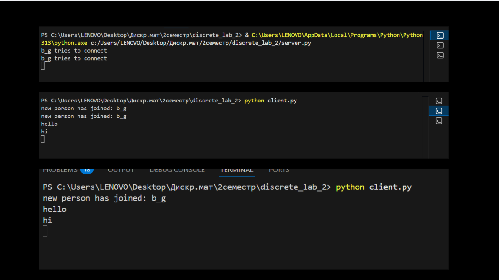

# discrete_lab_2
RSA algorithm

### Кроки запуску
**1. Запустити сервер** :
python server.py

**2. Запустити першого клієнта** :
python client.py 

**3. Запустити другого клієнта**:
python client.py

### Імплементації

**1. Генерація ключів**

Для генерації великих простих чисел використовується імовірнісний тест Міллера-Рабіна, який запускається 20 разів для підвищення точності. Відкрита експонента e встановлюється рівною 65537, що забезпечує баланс між безпекою та швидкістю. У випадку gcd(e, phi) != 1 e буде збільшуватися на 2 доки не пройде перевірку. Результатом є публічний ключ (e, n) та приватний ключ (d, n).

**2. Обмін ключами та передача secret**

Обмін ключами між сервером і клієнтом побудований за гібридною схемою, яка поєднує асиметричне RSA-шифрування для безпечної передачі спільного секрету та симетричне XOR-шифрування для захисту самих повідомлень.Отримавши публічний ключ клієнта, сервер генерує випадковий 256-бітний секретний ключ, шифрує його RSA-алгоритмом за допомогою отриманого публічного ключа клієнта та надсилає зашифрований секрет назад. Клієнт дешифрує секрет своїм приватним ключем. Після завершення цього рукостискання обидві сторони мають однаковий спільний секрет, який і використовується для шифрування всіх подальших повідомлень.
   
**3. Шифрування повідомлень**

Всі повідомлення шифруються симетричним шифром на основі XOR з використанням спільного секретного ключа, що циклічно повторюється до довжини повідомлення. Та сама функція використовується і для шифрування , і для розшифрування.

**4. Перевірка цілісності повідомлень**

Перед надсиланням та при отриманні рахується хеш оригінального повідомлення. Якщо повідомлення було змінено під час передачі і хеші будуть різними і користувач отримає відповідне повідомлення. 

Виконання :

